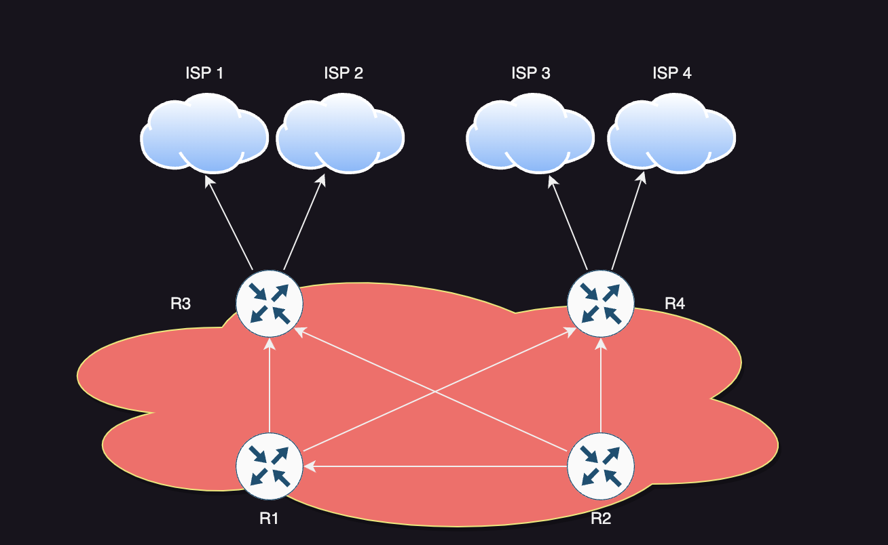
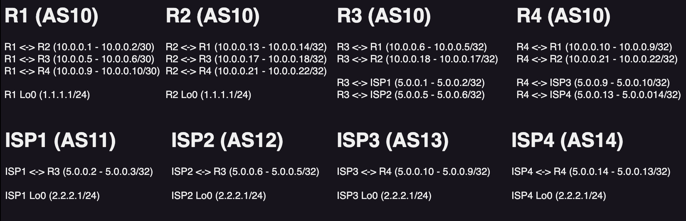

# Solent University Industrial Consulting
This is a team-building exercise to fix an exisitng BGP network. 

## Runbook POC Image
To edit this, you need to have the drawio extension on VSCode. This will display the network diagram with the subnetting plan. The network diagram looks like this:

The subnetting for this network will look like the following:
